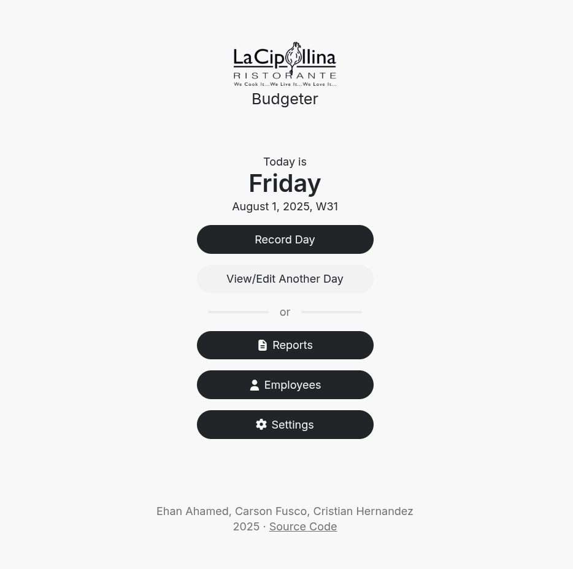

# La Cipollina Budgeter

Ehan Ahamed, Carson Fusco, Cristian Hernandez

https://freehold.dev/la-cipollina-budgeter



## updating the api

on your machine, compile it:
```sh
cd api
GOARCH=amd64 GOOS=linux go build -o api-server
```

after compiling, the executable is created at `api/la-cipollina-budgeter-api` use scp to send it to the server:
```sh
# on your machine
cd api
scp api-server root@12.345.678.901:/home/lacipollinabudgeter/budgeter-api/
```

then, on the server:
```sh
# on the server
cd /home/lacipollinabudgeter/budgeter-api/
chmod a+rx api-server
chown lacipollinabudgeter api-server
```

update the databse
```sh
sudo su postgres
psql -d la_cipollina_budgeter_db
# run commands in db/db-setup.sql
# i just copy & paste the file from vim:
# gg shift+v shift+g, alt+tab, control+shift+v
```

restart the service
```sh
systemctl stop la-cipollina-budgeter-api
systemctl start la-cipollina-budgeter-api
```
